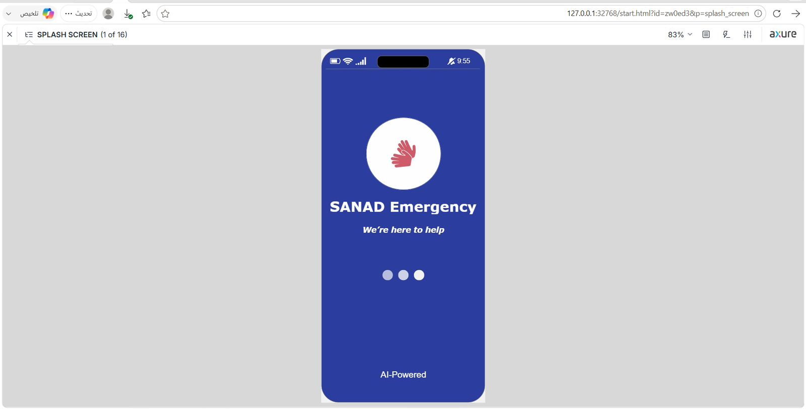
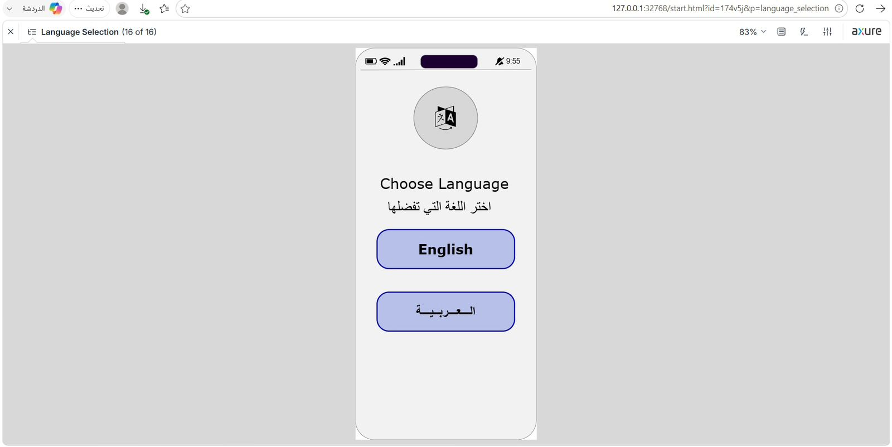
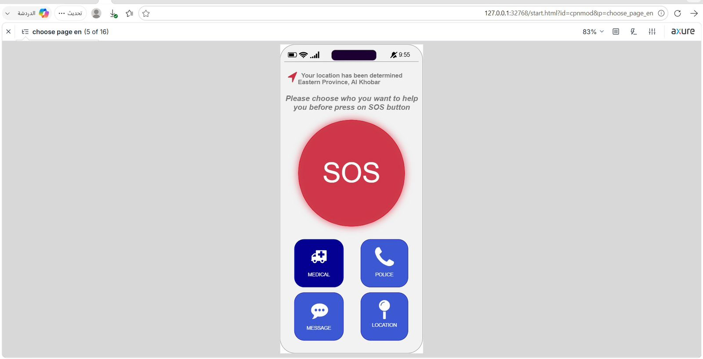
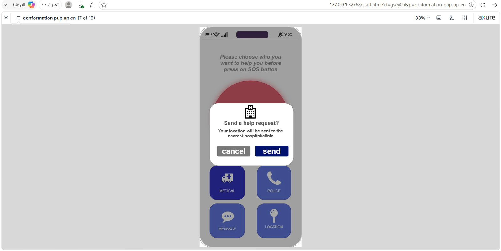
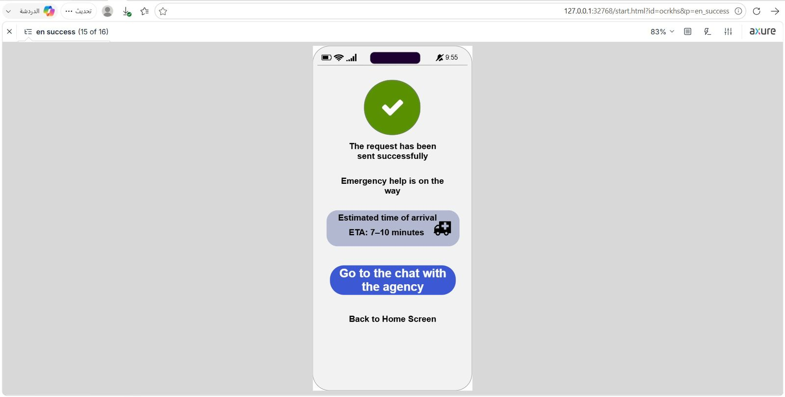
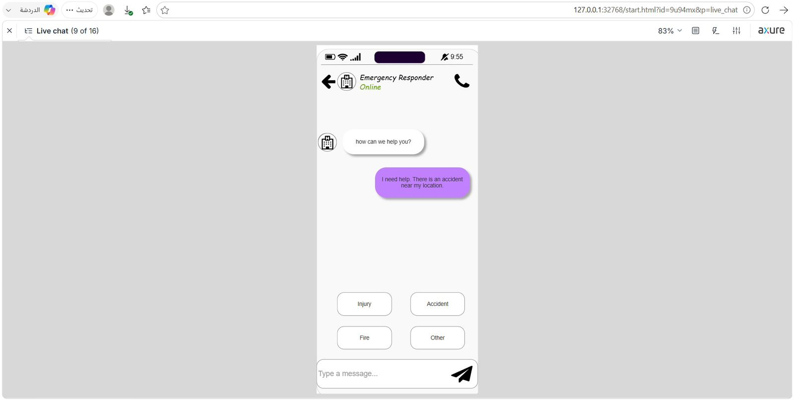
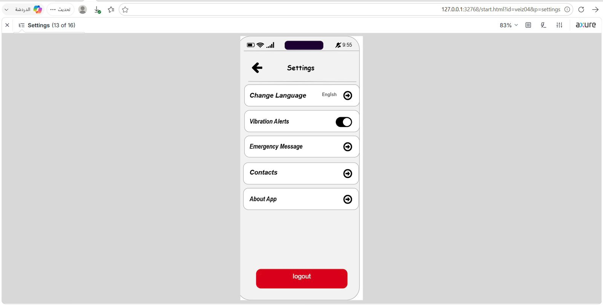

# SANAD: Accessible Emergency Assistance Application for People with Disabilities

SANAD is an all-embracing mobile application prototype designed to provide immediate, life-saving support for individuals suffering from visual, auditory, physical, or cognitive impairments. Built using Axure RP, the system strictly applies Human-Computer Interaction (HCI) and universal design principles to eradicate the complications of traditional emergency services under high-stress conditions.

## UI/UX Design Philosophy and Key Features

Our design philosophy focuses on maximizing UI (User Interface) accessibility and UX (User Experience) efficiency to eliminate psychological and physical barriers during emergencies.

### UI (User Interface) Optimization
- High-Contrast Layering: Utilizes a highly readable and high-contrast visual interface to support users facing age-related visual challenges, deterioration, or low-light environments.
- Amplified Touch Targets: Features oversized buttons, clear icons, and accessible font sizes, making interactive elements easy to target for aging demographics or users with hand tremors.
- Minimalist UI and Screen Clutter: Eliminates unnecessary text, complex navigation, or traditional multi-step forms, presenting only critical information to prevent visual distraction.

### UX (User Experience) and Cognitive Engineering
- Tailored for Older Adults (Elderly UX): Designed explicitly to reduce cognitive friction and memory anxiety for older adults under high-stress conditions.
- John Sweller’s Cognitive Load Theory: Eradicates traditional authentication and log-in procedures via a Zero-Login Architecture, allowing immediate system access when seconds matter.
- Mental Model Theory Alignment: Structures navigation layouts and interaction patterns based on familiar mobile behaviors, requiring zero learning curve for new or stressed users.
- Automatic GPS Localization UX: Automatically retrieves and previews live coordinates at startup, shifting the operational burden from the user to the system.
- Tremor-Countering SOS Interaction: A massive, centrally located emergency button designed to safely absorb accidental touches or sliding movements from shaky hands.
- Iconic Language Chatbot: A dedicated visual cue-driven communication workflow allowing deaf or mute users to report specific incidents (fire, medical, injury) via single-tap icons without text entry.

## Application Screenshots

Splash Screen: 
Language: 
Home: 
Confirmation: 
 Tracking: 
 Chatbot: 
Settings: 
